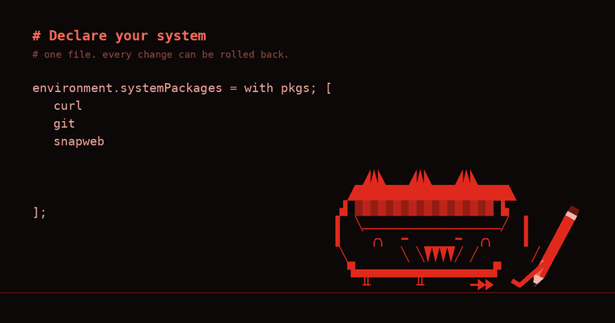
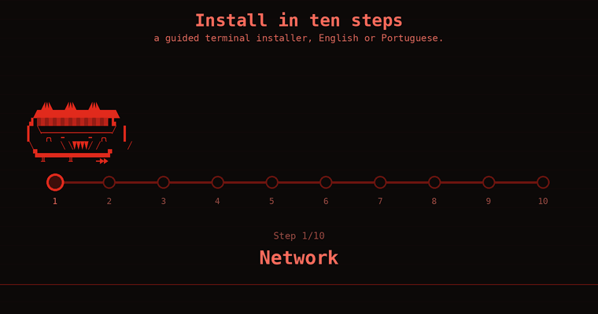
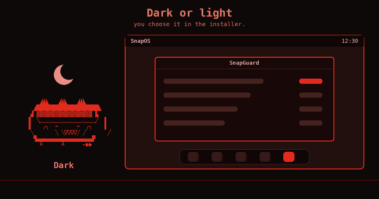
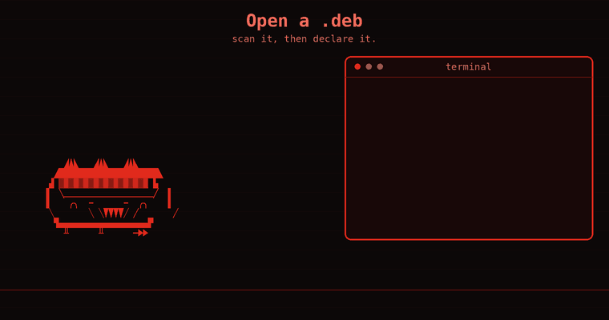
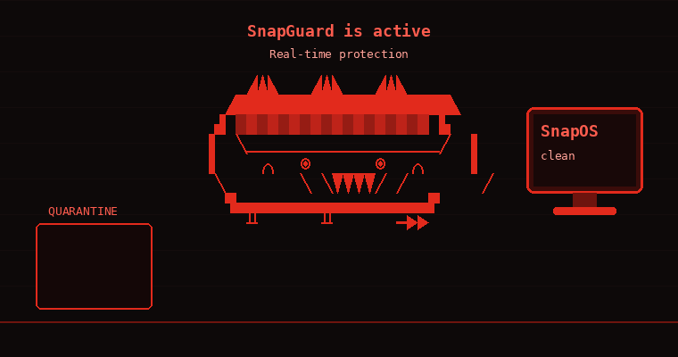

<p align="center">
  
</p>

<h1 align="center">SnapOS</h1>

<p align="center">A declarative, security-focused Linux distribution built on NixOS.</p>

---

SnapOS is a Budgie desktop with a red theme, a built-in defender (SnapGuard),
its own web browser (SnapWeb) and a guided terminal installer. The whole system
is described in one file, `configuration.nix`, and every change can be rolled
back from the boot menu.

## What you get

- **One file describes the system.** `snapos config` opens it, `snapos rebuild`
  applies it.
- **SnapGuard**, the defender, based on ClamAV. Threats go to quarantine and
  nothing is deleted without your approval. One command, `snapguard`, opens the
  window and does everything else.
- **SnapWeb**, the browser: official Firefox with a dark and red look, a start
  page, an empty bookmarks bar and Google search.
- **Software**: GNOME Software with Flatpak and Flathub. Open a `.deb` file and
  SnapOS scans it, then offers to add it to your configuration (`snap-deb`).
- **A dock** 45 pixels high with the defender, the browser, the programs store
  and the terminal pinned.
- **Dark or light desktop**, chosen in the installer: theme, icons, wallpaper,
  login screen, the SnapGuard shield and the SnapWeb browser all follow it. On the
  light desktop every text is black or red.
- **SnapHelper**, a short tour that opens the first time you log in (also in the
  menu): declaring apps, opening a `.deb`, SnapGuard. Use the arrow keys or the
  Next and Back buttons.
- **Terminal installer** in ten steps, in English or Portuguese, for BIOS and
  UEFI computers.
- **Graphics that adapt.** On laptops with two graphics chips the installer can
  use the Intel chip only.
- **Small C tools** for everything else, in [`src/`](src/).

## Install

<p align="center">
  
</p>

1. Download `snapos-installer.iso` from the Releases page.
2. Write it to a USB drive with balenaEtcher, or with `dd`.
3. Boot from the USB drive. The installer starts by itself.

The installer asks for: network, keyboard, language, time zone, disk, account,
appearance (dark or light) and graphics, then shows a review before it
installs. English is the default;
choose Portuguese on the first screen if you prefer it.

If SnapOS is already installed, run the installer again and pick **Update SnapOS
(keeps your files)**.

## Dark or light

The installer asks whether you want a dark or a light desktop. The theme,
icons, wallpaper, login screen, the SnapGuard shield and SnapWeb all follow it.
To switch later, change `snapos.appearance` in `/etc/nixos/local.nix` and run
`snapos rebuild`.

<p align="center">
  
</p>

## Commands

| Command | Description |
| --- | --- |
| `snapos config` | open `configuration.nix` in your editor |
| `snapos rebuild` | apply your changes to the system |
| `snapos doctor` | check graphics, boot and antivirus problems |
| `snap-deb FILE.deb` | scan a `.deb`, then add it to SnapOS (also what double-clicking one does) |
| `snap-deb list` / `remove NAME` | packages added this way |
| `snapctl run <program>` | scan, draft and run a program that is not installed |
| `snapctl save` / `discard` / `list` / `diff` / `status` | keep or drop drafted programs |
| `snapguard` | open the SnapGuard window |
| `snapguard scan <file or folder>` | scan from the command line |
| `snapguard status` | is the antivirus working? |
| `snapguard quarantine <path>` | contain a file |
| `snapguard list` | show what is in quarantine |
| `snapguard restore <name>` / `delete <name>` / `trust <path>` | decide what happens to a contained file |
| `snapweb` | the web browser |
| `snaphelper` | the SnapHelper tour (opens by itself the first time you log in) |
| `snappy` / `snappy feed` / `snappy pet` | the mascot |
| `fastfetch` | system information |

`snapos` asks for root through `sudo` on its own.

## Installing programs

Programs are listed in `configuration.nix`:

```nix
environment.systemPackages = with pkgs; [
  curl
  dpkg
  fastfetch
  git
  gnome-software
  pciutils
  snapguard
  snapos-tools
  snapweb
];
```

Add a name and run `snapos rebuild`. `snapctl run <program>` tries a program
first and adds it to the list only when you run `snapctl save`. There is no
`apt`: SnapOS is declarative.

A `.deb` file works the same way: `snap-deb` scans it with SnapGuard, copies it
to `/etc/nixos/debs` and the next `snapos rebuild` builds it. Not every `.deb`
works, because a program that needs Debian services or a specific Debian
library may not start.

<p align="center">
  
</p>

## SnapGuard

<p align="center">
  
</p>

SnapGuard combines ClamAV, a SnapOS hash list and a trust list. When a scan
finds a threat, the file is moved to quarantine and its execute bits are
removed. You then choose to **keep and trust** it or **delete** it.

The window offers a quick scan of Downloads, folder and file scans and a
quarantine view. While it scans it shows each file as it is checked, and when
it finishes it says how many files were checked, what was found, and what could
not be checked. `snapguard status` shows whether the engine,
the daemon and the virus database are in place. The database downloads on the
first boot with internet. See [docs/SECURITY.md](docs/SECURITY.md) for the
design.

## Build it yourself

You need Nix with flakes enabled.

```bash
nix build .#iso             # the installer image, in result/iso/
nix build .#toplevel        # the installed system
make all gui && make test   # the C tools and their tests
```

Apps that SnapOS ships in its own version live in [`custom-apps/`](custom-apps/).
Each folder there becomes a package automatically; SnapWeb is one of them.

## Repository layout

| Path | Contents |
| --- | --- |
| `configuration.nix` | the system declaration and the program list |
| `flake.nix` | overlay, `.#iso`, `.#toplevel`, `.#snapos-tools`, checks |
| `nix/modules/` | desktop, theme, defender, hardware and defaults |
| `nix/iso.nix` | the installer image |
| `nix/installer/` | the installer |
| `nix/pkgs/` | SnapOS packages: tools, SnapGuard window, icons, wallpapers |
| `nix/tests/` | virtual machine tests |
| `custom-apps/` | apps SnapOS ships in its own version (SnapWeb) |
| `src/` | the C tools |
| `security/` | SnapGuard signature list and allowlist |
| `docs/` | the security design |
| `branding/` | logo, icons, wallpapers, fastfetch configuration |
| `tests/` | tests for the C tools and the repository |
| `.github/workflows/` | ISO build, desktop test and SnapGuard check |

## License

MIT, see [LICENSE](LICENSE).

---

SnapOS was created as the final project (TCC) of a 15-year-old student. The goal
is to give you total control of your system while shipping an OS with strong
built-in security, good performance, and a friendlier learning curve than Nix.

AI assisted (Sonnet 5)
